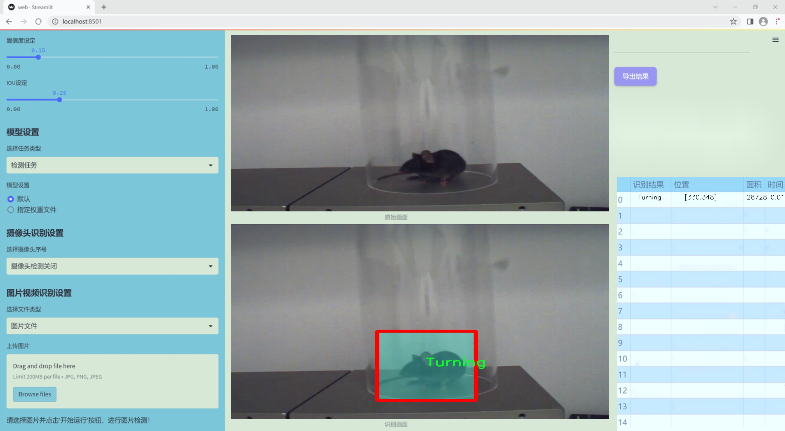
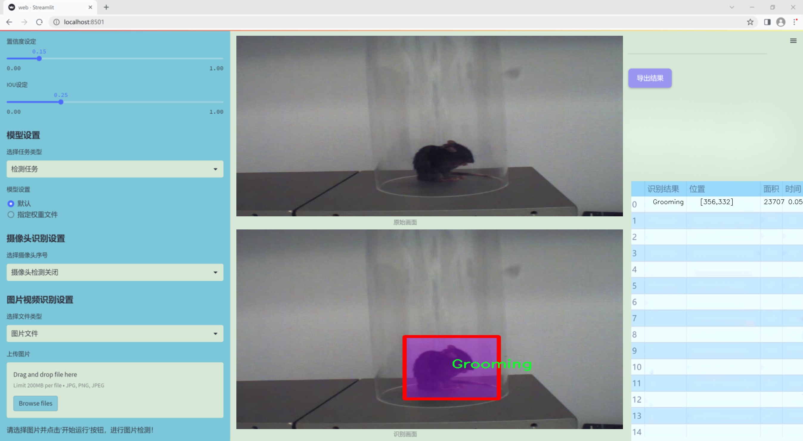
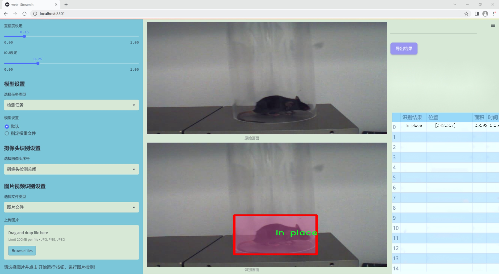
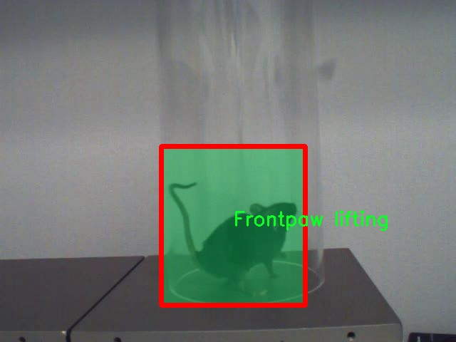
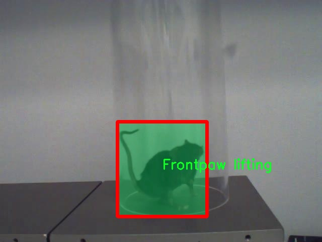
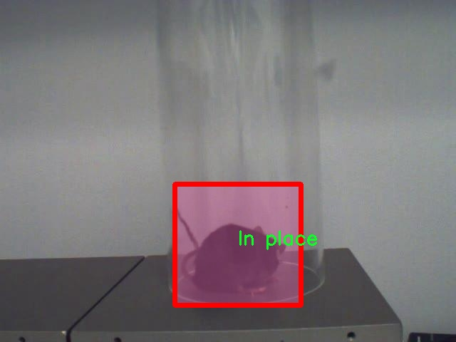
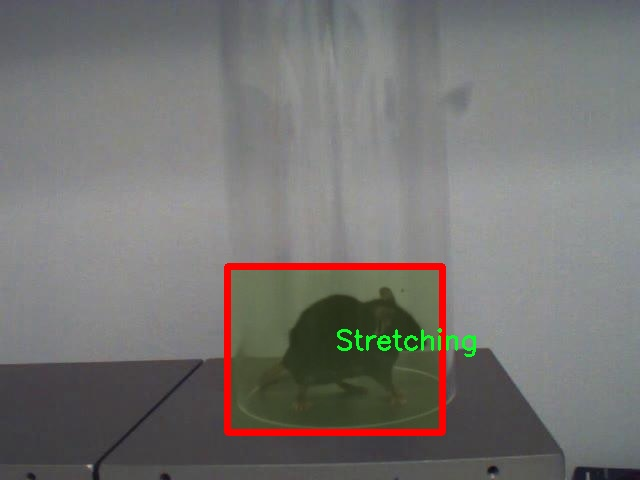
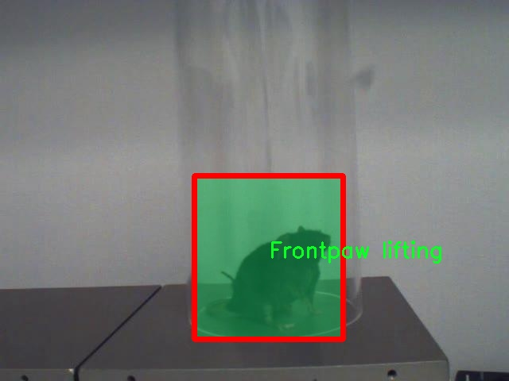

### 1.背景意义

研究背景与意义

小鼠作为一种重要的实验动物，广泛应用于生物医学研究、药物开发和行为科学等领域。通过对小鼠行为的深入分析，研究人员能够获得关于神经生物学、心理学和药理学等方面的重要信息。传统的行为观察方法往往依赖于人工记录，不仅耗时耗力，而且容易受到观察者主观因素的影响。因此，开发一种高效、准确的小鼠行为识别系统显得尤为重要。

近年来，计算机视觉技术的快速发展为动物行为识别提供了新的解决方案。YOLO（You Only Look Once）系列模型因其实时性和高精度的特点，成为目标检测领域的热门选择。YOLOv11作为该系列的最新版本，进一步提升了模型的性能，能够在复杂环境中实现更为精确的行为识别。通过对小鼠行为的自动化识别，不仅可以提高实验数据的可靠性，还能为行为学研究提供更为丰富的定量分析。

本研究旨在基于改进的YOLOv11模型，构建一个小鼠行为识别系统。该系统将利用一个包含2200张图像的数据集，涵盖了小鼠的十种典型行为，包括前爪舔舐、前爪抬起、梳理、后爪舔舐、后爪抬起、原地、跳跃、直立、伸展和转身等。这些行为的多样性为模型的训练提供了丰富的样本，有助于提高识别的准确性和鲁棒性。

通过本项目的实施，期望能够为小鼠行为研究提供一种高效、自动化的工具，推动相关领域的研究进展。同时，基于YOLOv11的改进模型也将为其他动物行为识别的研究提供借鉴，促进计算机视觉技术在生物医学领域的应用与发展。

### 2.视频效果

[2.1 视频效果]()

### 3.图片效果







##### [项目涉及的源码数据来源链接](https://kdocs.cn/l/cszuIiCKVNis)**

注意：本项目提供训练的数据集和训练教程,由于版本持续更新,暂不提供权重文件（best.pt）,请按照6.训练教程进行训练后实现上图演示的效果。

### 4.数据集信息

##### 4.1 本项目数据集类别数＆类别名

nc: 10
names: ['Frontpaw licking', 'Frontpaw lifting', 'Grooming', 'Hindpaw licking', 'Hindpaw lifting', 'In place', 'Jumping', 'Rearing', 'Stretching', 'Turning']


该项目为【图像分割】数据集，请在【训练教程和Web端加载模型教程（第三步）】这一步的时候按照【图像分割】部分的教程来训练

##### 4.2 本项目数据集信息介绍

本项目数据集信息介绍

本项目旨在通过改进YOLOv11模型，提升小鼠行为识别系统的准确性与效率。为实现这一目标，我们采用了“Hotplate_behavior_annotations”数据集，该数据集专注于小鼠在热板实验中的多种行为表现，涵盖了丰富的行为类别，适合用于训练和验证深度学习模型。数据集中包含10个主要的行为类别，具体包括：前爪舔舐、前爪抬起、梳理、后爪舔舐、后爪抬起、原地活动、跳跃、竖立、伸展以及转身。这些行为类别不仅具有显著的生物学意义，还能为研究小鼠的疼痛反应、活动水平及其他生理行为提供重要的参考。

在数据集的构建过程中，所有行为均经过精确标注，确保每个样本的行为特征清晰可辨。这一过程涉及到对小鼠在热板上行为的细致观察与记录，确保数据的真实性和可靠性。通过对这些行为的深入分析，我们能够更好地理解小鼠在不同环境刺激下的反应机制，为相关生物医学研究提供坚实的数据基础。

此外，数据集的多样性和丰富性为模型的训练提供了广泛的样本支持，使得YOLOv11在识别小鼠行为时能够具备更强的泛化能力。通过使用这一数据集，我们希望能够在小鼠行为识别领域取得突破性进展，推动相关研究的深入发展。整体而言，“Hotplate_behavior_annotations”数据集不仅为本项目提供了必要的训练数据，也为未来在小鼠行为学及其相关领域的研究奠定了坚实的基础。











### 5.全套项目环境部署视频教程（零基础手把手教学）

[5.1 所需软件PyCharm和Anaconda安装教程（第一步）](https://www.bilibili.com/video/BV1BoC1YCEKi/?spm_id_from=333.999.0.0&vd_source=bc9aec86d164b67a7004b996143742dc)


[5.2 安装Python虚拟环境创建和依赖库安装视频教程（第二步）](https://www.bilibili.com/video/BV1ZoC1YCEBw?spm_id_from=333.788.videopod.sections&vd_source=bc9aec86d164b67a7004b996143742dc)

### 6.改进YOLOv11训练教程和Web_UI前端加载模型教程（零基础手把手教学）

[6.1 改进YOLOv11训练教程和Web_UI前端加载模型教程（第三步）](https://www.bilibili.com/video/BV1BoC1YCEhR?spm_id_from=333.788.videopod.sections&vd_source=bc9aec86d164b67a7004b996143742dc)


按照上面的训练视频教程链接加载项目提供的数据集，运行train.py即可开始训练



     Epoch   gpu_mem       box       obj       cls    labels  img_size
     1/200     20.8G   0.01576   0.01955  0.007536        22      1280: 100%|██████████| 849/849 [14:42<00:00,  1.04s/it]
               Class     Images     Labels          P          R     mAP@.5 mAP@.5:.95: 100%|██████████| 213/213 [01:14<00:00,  2.87it/s]
                 all       3395      17314      0.994      0.957      0.0957      0.0843

     Epoch   gpu_mem       box       obj       cls    labels  img_size
     2/200     20.8G   0.01578   0.01923  0.007006        22      1280: 100%|██████████| 849/849 [14:44<00:00,  1.04s/it]
               Class     Images     Labels          P          R     mAP@.5 mAP@.5:.95: 100%|██████████| 213/213 [01:12<00:00,  2.95it/s]
                 all       3395      17314      0.996      0.956      0.0957      0.0845

     Epoch   gpu_mem       box       obj       cls    labels  img_size
     3/200     20.8G   0.01561    0.0191  0.006895        27      1280: 100%|██████████| 849/849 [10:56<00:00,  1.29it/s]
               Class     Images     Labels          P          R     mAP@.5 mAP@.5:.95: 100%|███████   | 187/213 [00:52<00:00,  4.04it/s]
                 all       3395      17314      0.996      0.957      0.0957      0.0845


###### [项目数据集下载链接](https://kdocs.cn/l/cszuIiCKVNis)

### 7.原始YOLOv11算法讲解

YOLOv11是Ultralytics推出的YOLO系列最新版本，专为实现尖端的物体检测而设计。其架构和训练方法上进行了重大改进，使之不仅具备卓越的准确性和处理速度，还在计算效率上实现了一场革命。得益于其改进的主干和颈部架构，YOLOv11在特征提取和处理复杂任务时表现更加出色。在2024年9月27日，Ultralytics通过长达九小时的在线直播发布这一新作，展示了其在计算机视觉领域的革新。

YOLOv11通过精细的架构设计和优化训练流程，在保持高精度的同时，缩减了参数量，与YOLOv8m相比减少了22%的参数，使其在COCO数据集上的平均准确度（mAP）有所提升。这种效率的提高使YOLOv11非常适合部署在各种硬件环境中，包括边缘设备、云计算平台以及支持NVIDIA GPU的系统，确保在灵活性上的优势。

该模型支持广泛的任务，从对象检测、实例分割到图像分类、姿态估计和定向对象检测（OBB），几乎覆盖了计算机视觉的所有主要挑战。其创新的C3k2和C2PSA模块提升了网络深度和注意力机制的应用，提高了特征提取的效率和效果。同时，YOLOv11的改进网络结构也使之在复杂视觉任务上得以从容应对，成为各类计算机视觉任务的多功能选择。这些特性令YOLOv11在实施实时物体检测的各个领域中表现出众。
* * *

2024年9月27日，Ultralytics在线直播长达九小时，为YOLO11召开“发布会”

YOLO11 是 Ultralytics YOLO 系列实时物体检测器的最新版本，它以尖端的准确性、速度和效率重新定义了可能性。在之前 YOLO
版本的显著进步的基础上，YOLO11 在架构和训练方法方面进行了重大改进，使其成为各种计算机视觉任务的多功能选择。


##### YOLO11主要特点：

  * 增强的特征提取：YOLO11 采用了改进的主干和颈部架构，增强了特征提取能力，可实现更精确的对象检测和复杂任务性能。
  * 针对效率和速度进行了优化：YOLO11 引入了完善的架构设计和优化的训练流程，可提供更快的处理速度，并在准确度和性能之间保持最佳平衡。
  * 更少的参数，更高的准确度：借助模型设计的进步，YOLO11m 在 COCO 数据集上实现了更高的平均准确度 (mAP)，同时使用的参数比 YOLOv8m 少 22%，从而提高了计算效率，同时又不影响准确度。
  * 跨环境的适应性：YOLO11 可以无缝部署在各种环境中，包括边缘设备、云平台和支持 NVIDIA GPU 的系统，从而确保最大的灵活性。
  * 支持的任务范围广泛：无论是对象检测、实例分割、图像分类、姿势估计还是定向对象检测 (OBB)，YOLO11 都旨在满足各种计算机视觉挑战。

##### 支持的任务和模式

YOLO11 以 YOLOv8 中引入的多功能模型系列为基础，为各种计算机视觉任务提供增强的支持：

Model| Filenames| Task| Inference| Validation| Training| Export  
---|---|---|---|---|---|---  
YOLO11| yolol11n.pt, yolol11s.pt, yolol11m.pt, yolol11x.pt| Detection| ✅| ✅|
✅| ✅  
YOLO11-seg| yolol11n-seg.pt, yolol11s-seg.pt, yolol11m-seg.pt,
yolol11x-seg.pt| Instance Segmentation| ✅| ✅| ✅| ✅  
YOLO11-pose| yolol11n-pose.pt, yolol11s-pose.pt, yolol11m-pose.pt,
yolol11x-pose.pt| Pose/Keypoints| ✅| ✅| ✅| ✅  
YOLO11-obb| yolol11n-obb.pt, yolol11s-obb.pt, yolol11m-obb.pt,
yolol11x-obb.pt| Oriented Detection| ✅| ✅| ✅| ✅  
YOLO11-cls| yolol11n-cls.pt, yolol11s-cls.pt, yolol11m-cls.pt,
yolol11x-cls.pt| Classification| ✅| ✅| ✅| ✅  
  
##### 简单的 YOLO11 训练和推理示例

以下示例适用于用于对象检测的 YOLO11 Detect 模型。

    
    
    from ultralytics import YOLO
    
    # Load a model
    model = YOLO("yolo11n.pt")
    
    # Train the model
    train_results = model.train(
        data="coco8.yaml",  # path to dataset YAML
        epochs=100,  # number of training epochs
        imgsz=640,  # training image size
        device="cpu",  # device to run on, i.e. device=0 or device=0,1,2,3 or device=cpu
    )
    
    # Evaluate model performance on the validation set
    metrics = model.val()
    
    # Perform object detection on an image
    results = model("path/to/image.jpg")
    results[0].show()
    
    # Export the model to ONNX format
    path = model.export(format="onnx")  # return path to exported model

##### 支持部署于边缘设备

YOLO11 专为适应各种环境而设计，包括边缘设备。其优化的架构和高效的处理能力使其适合部署在边缘设备、云平台和支持 NVIDIA GPU
的系统上。这种灵活性确保 YOLO11 可用于各种应用，从移动设备上的实时检测到云环境中的复杂分割任务。有关部署选项的更多详细信息，请参阅导出文档。

##### YOLOv11 yaml文件

    
    
    # Ultralytics YOLO 🚀, AGPL-3.0 license
    # YOLO11 object detection model with P3-P5 outputs. For Usage examples see https://docs.ultralytics.com/tasks/detect
    
    # Parameters
    nc: 80 # number of classes
    scales: # model compound scaling constants, i.e. 'model=yolo11n.yaml' will call yolo11.yaml with scale 'n'
      # [depth, width, max_channels]
      n: [0.50, 0.25, 1024] # summary: 319 layers, 2624080 parameters, 2624064 gradients, 6.6 GFLOPs
      s: [0.50, 0.50, 1024] # summary: 319 layers, 9458752 parameters, 9458736 gradients, 21.7 GFLOPs
      m: [0.50, 1.00, 512] # summary: 409 layers, 20114688 parameters, 20114672 gradients, 68.5 GFLOPs
      l: [1.00, 1.00, 512] # summary: 631 layers, 25372160 parameters, 25372144 gradients, 87.6 GFLOPs
      x: [1.00, 1.50, 512] # summary: 631 layers, 56966176 parameters, 56966160 gradients, 196.0 GFLOPs
    
    # YOLO11n backbone
    backbone:
      # [from, repeats, module, args]
      - [-1, 1, Conv, [64, 3, 2]] # 0-P1/2
      - [-1, 1, Conv, [128, 3, 2]] # 1-P2/4
      - [-1, 2, C3k2, [256, False, 0.25]]
      - [-1, 1, Conv, [256, 3, 2]] # 3-P3/8
      - [-1, 2, C3k2, [512, False, 0.25]]
      - [-1, 1, Conv, [512, 3, 2]] # 5-P4/16
      - [-1, 2, C3k2, [512, True]]
      - [-1, 1, Conv, [1024, 3, 2]] # 7-P5/32
      - [-1, 2, C3k2, [1024, True]]
      - [-1, 1, SPPF, [1024, 5]] # 9
      - [-1, 2, C2PSA, [1024]] # 10
    
    # YOLO11n head
    head:
      - [-1, 1, nn.Upsample, [None, 2, "nearest"]]
      - [[-1, 6], 1, Concat, [1]] # cat backbone P4
      - [-1, 2, C3k2, [512, False]] # 13
    
      - [-1, 1, nn.Upsample, [None, 2, "nearest"]]
      - [[-1, 4], 1, Concat, [1]] # cat backbone P3
      - [-1, 2, C3k2, [256, False]] # 16 (P3/8-small)
    
      - [-1, 1, Conv, [256, 3, 2]]
      - [[-1, 13], 1, Concat, [1]] # cat head P4
      - [-1, 2, C3k2, [512, False]] # 19 (P4/16-medium)
    
      - [-1, 1, Conv, [512, 3, 2]]
      - [[-1, 10], 1, Concat, [1]] # cat head P5
      - [-1, 2, C3k2, [1024, True]] # 22 (P5/32-large)
    
      - [[16, 19, 22], 1, Detect, [nc]] # Detect(P3, P4, P5)
    

**YOLO11和YOLOv8 yaml文件的区别**


##### 改进模块代码

  * C3k2 

    
    
    class C3k2(C2f):
        """Faster Implementation of CSP Bottleneck with 2 convolutions."""
    
        def __init__(self, c1, c2, n=1, c3k=False, e=0.5, g=1, shortcut=True):
            """Initializes the C3k2 module, a faster CSP Bottleneck with 2 convolutions and optional C3k blocks."""
            super().__init__(c1, c2, n, shortcut, g, e)
            self.m = nn.ModuleList(
                C3k(self.c, self.c, 2, shortcut, g) if c3k else Bottleneck(self.c, self.c, shortcut, g) for _ in range(n)
            )

C3k2，它是具有两个卷积的CSP（Partial Cross Stage）瓶颈架构的更快实现。

**类继承：**

  * `C3k2`继承自类`C2f`。这表明`C2f`很可能实现了经过修改的基本CSP结构，而`C3k2`进一步优化或修改了此结构。

**构造函数（`__init__`）：**

  * `c1`：输入通道。

  * `c2`：输出通道。

  * `n`：瓶颈层数（默认为1）。

  * `c3k`：一个布尔标志，确定是否使用`C3k`块或常规`Bottleneck`块。

  * `e`：扩展比率，控制隐藏层的宽度（默认为0.5）。

  * `g`：分组卷积的组归一化参数或组数（默认值为 1）。

  * `shortcut`：一个布尔值，用于确定是否在网络中包含快捷方式连接（默认值为 `True`）。

**初始化：**

  * `super().__init__(c1, c2, n, short-cut, g, e)` 调用父类 `C2f` 的构造函数，初始化标准 CSP 组件，如通道数、快捷方式、组等。

**模块列表（`self.m`）：**

  * `nn.ModuleList` 存储 `C3k` 或 `Bottleneck` 模块，具体取决于 `c3k` 的值。

  * 如果 `c3k` 为 `True`，它会初始化 `C3k` 模块。`C3k` 模块接收以下参数：

  * `self.c`：通道数（源自 `C2f`）。

  * `2`：这表示在 `C3k` 块内使用了两个卷积层。

  * `shortcut` 和 `g`：从 `C3k2` 构造函数传递。

  * 如果 `c3k` 为 `False`，则初始化标准 `Bottleneck` 模块。

`for _ in range(n)` 表示将创建 `n` 个这样的块。

**总结：**

  * `C3k2` 实现了 CSP 瓶颈架构，可以选择使用自定义 `C3k` 块（具有两个卷积）或标准 `Bottleneck` 块，具体取决于 `c3k` 标志。

  * C2PSA

    
    
    class C2PSA(nn.Module):
        """
        C2PSA module with attention mechanism for enhanced feature extraction and processing.
    
        This module implements a convolutional block with attention mechanisms to enhance feature extraction and processing
        capabilities. It includes a series of PSABlock modules for self-attention and feed-forward operations.
    
        Attributes:
            c (int): Number of hidden channels.
            cv1 (Conv): 1x1 convolution layer to reduce the number of input channels to 2*c.
            cv2 (Conv): 1x1 convolution layer to reduce the number of output channels to c.
            m (nn.Sequential): Sequential container of PSABlock modules for attention and feed-forward operations.
    
        Methods:
            forward: Performs a forward pass through the C2PSA module, applying attention and feed-forward operations.
    
        Notes:
            This module essentially is the same as PSA module, but refactored to allow stacking more PSABlock modules.
    
        Examples:
            >>> c2psa = C2PSA(c1=256, c2=256, n=3, e=0.5)
            >>> input_tensor = torch.randn(1, 256, 64, 64)
            >>> output_tensor = c2psa(input_tensor)
        """
    
        def __init__(self, c1, c2, n=1, e=0.5):
            """Initializes the C2PSA module with specified input/output channels, number of layers, and expansion ratio."""
            super().__init__()
            assert c1 == c2
            self.c = int(c1 * e)
            self.cv1 = Conv(c1, 2 * self.c, 1, 1)
            self.cv2 = Conv(2 * self.c, c1, 1)
    
            self.m = nn.Sequential(*(PSABlock(self.c, attn_ratio=0.5, num_heads=self.c // 64) for _ in range(n)))
    
        def forward(self, x):
            """Processes the input tensor 'x' through a series of PSA blocks and returns the transformed tensor."""
            a, b = self.cv1(x).split((self.c, self.c), dim=1)
            b = self.m(b)
            return self.cv2(torch.cat((a, b), 1))

`C2PSA` 模块是一个自定义神经网络层，带有注意力机制，用于增强特征提取和处理。

**类概述**

  * **目的：**

  * `C2PSA` 模块引入了一个卷积块，利用注意力机制来改进特征提取和处理。

  * 它使用一系列 `PSABlock` 模块，这些模块可能代表某种形式的位置自注意力 (PSA)，并且该架构旨在允许堆叠多个 `PSABlock` 层。

**构造函数（`__init__`）：**

  * **参数：**

  * `c1`：输入通道（必须等于 `c2`）。

  * `c2`：输出通道（必须等于 `c1`）。

  * `n`：要堆叠的 `PSABlock` 模块数量（默认值为 1）。

  * `e`：扩展比率，用于计算隐藏通道的数量（默认值为 0.5）。

  * **属性：**

  * `self.c`：隐藏通道数，计算为 `int(c1 * e)`。

  * `self.cv1`：一个 `1x1` 卷积，将输入通道数从 `c1` 减少到 `2 * self.c`。这为将输入分成两部分做好准备。

  * `self.cv2`：另一个 `1x1` 卷积，处理后将通道维度恢复回 `c1`。

  * `self.m`：一系列 `PSABlock` 模块。每个 `PSABlock` 接收 `self.c` 通道，注意头的数量为 `self.c // 64`。每个块应用注意和前馈操作。

**前向方法：**

  * **输入：**

  * `x`，输入张量。

  * **操作：**

  1. `self.cv1(x)` 应用 `1x1` 卷积，将输入通道大小从 `c1` 减小到 `2 * self.c`。

  2. 生成的张量沿通道维度分为两部分，`a` 和 `b`。

  * `a`：第一个 `self.c` 通道。

  * `b`：剩余的 `self.c` 通道。

  1. `b` 通过顺序容器 `self.m`，它是 `PSABlock` 模块的堆栈。这部分经过基于注意的处理。

  2. 处理后的张量 `b` 与 `a` 连接。

  3. `self.cv2` 应用 `1x1` 卷积，将通道大小恢复为 `c1`。

  * **输出：**

  * 应用注意和卷积操作后的变换后的张量。

**总结：**

  * **C2PSA** 是一个增强型卷积模块，它通过堆叠的 `PSABlock` 模块应用位置自注意力。它拆分输入张量，将注意力应用于其中一部分，然后重新组合并通过最终卷积对其进行处理。此结构有助于从输入数据中提取复杂特征。

##### 网络结构


### 8.200+种全套改进YOLOV11创新点原理讲解

#### 8.1 200+种全套改进YOLOV11创新点原理讲解大全

由于篇幅限制，每个创新点的具体原理讲解就不全部展开，具体见下列网址中的改进模块对应项目的技术原理博客网址【Blog】（创新点均为模块化搭建，原理适配YOLOv5~YOLOv11等各种版本）

[改进模块技术原理博客【Blog】网址链接](https://gitee.com/qunmasj/good)


#### 8.2 精选部分改进YOLOV11创新点原理讲解

###### 这里节选部分改进创新点展开原理讲解(完整的改进原理见上图和[改进模块技术原理博客链接](https://gitee.com/qunmasj/good)【如果此小节的图加载失败可以通过CSDN或者Github搜索该博客的标题访问原始博客，原始博客图片显示正常】

### MS-Block简介
实时目标检测，以YOLO系列为例，已在工业领域中找到重要应用，特别是在边缘设备（如无人机和机器人）中。与之前的目标检测器不同，实时目标检测器旨在在速度和准确性之间追求最佳平衡。为了实现这一目标，提出了大量的工作：从第一代DarkNet到CSPNet，再到最近的扩展ELAN，随着性能的快速增长，实时目标检测器的架构经历了巨大的变化。

尽管性能令人印象深刻，但在不同尺度上识别对象仍然是实时目标检测器面临的基本挑战。这促使作者设计了一个强大的编码器架构，用于学习具有表现力的多尺度特征表示。具体而言，作者从两个新的角度考虑为实时目标检测编码多尺度特征：

从局部视角出发，作者设计了一个具有简单而有效的分层特征融合策略的MS-Block。受到Res2Net的启发，作者在MS-Block中引入了多个分支来进行特征提取，但不同的是，作者使用了一个带有深度卷积的 Inverted Bottleneck Block块，以实现对大Kernel的高效利用。

从全局视角出发，作者提出随着网络加深逐渐增加卷积的Kernel-Size。作者在浅层使用小Kernel卷积来更高效地处理高分辨率特征。另一方面，在深层中，作者采用大Kernel卷积来捕捉广泛的信息。

基于以上设计原则，作者呈现了作者的实时目标检测器，称为YOLO-MS。为了评估作者的YOLO-MS的性能，作者在MS COCO数据集上进行了全面的实验。还提供了与其他最先进方法的定量比较，以展示作者方法的强大性能。如图1所示，YOLO-MS在计算性能平衡方面优于其他近期的实时目标检测器。


具体而言，YOLO-MS-XS在MS COCO上获得了43%+的AP得分，仅具有450万个可学习参数和8.7亿个FLOPs。YOLO-MS-S和YOLO-MS分别获得了46%+和51%+的AP，可学习参数分别为810万和2220万。此外，作者的工作还可以作为其他YOLO模型的即插即用模块。通常情况下，作者的方法可以将YOLOv11的AP从37%+显著提高到40%+，甚至还可以使用更少的参数和FLOPs。

CSP Block是一个基于阶段级梯度路径的网络，平衡了梯度组合和计算成本。它是广泛应用于YOLO系列的基本构建块。已经提出了几种变体，包括YOLOv4和YOLOv11中的原始版本，Scaled YOLOv4中的CSPVoVNet，YOLOv11中的ELAN，以及RTMDet中提出的大Kernel单元。作者在图2(a)和图2(b)中分别展示了原始CSP块和ELAN的结构。


上述实时检测器中被忽视的一个关键方面是如何在基本构建块中编码多尺度特征。其中一个强大的设计原则是Res2Net，它聚合了来自不同层次的特征以增强多尺度表示。然而，这一原则并没有充分探索大Kernel卷积的作用，而大Kernel卷积已经在基于CNN的视觉识别任务模型中证明有效。将大Kernel卷积纳入Res2Net的主要障碍在于它们引入的计算开销，因为构建块采用了标准卷积。在作者的方法中，作者提出用 Inverted Bottleneck Block替代标准的3 × 3卷积，以享受大Kernel卷积的好处。

#### MS-Block

基于前面的分析，参考该博客提出了一个带有分层特征融合策略的全新Block，称为MS-Block，以增强实时目标检测器在提取多尺度特征时的能力，同时保持快速的推理速度。

MS-Block的具体结构如图2(c)所示。假设是输入特征。通过1×1卷积的转换后，X的通道维度增加到n*C。然后，作者将X分割成n个不同的组，表示为，其中。为了降低计算成本，作者选择n为3。

注意，除了之外，每个其他组都经过一个 Inverted Bottleneck Block层，用表示，其中k表示Kernel-Size，以获得。的数学表示如下：


根据这个公式，作者不将 Inverted Bottleneck Block层连接到，使其作为跨阶段连接，并保留来自前面层的信息。最后，作者将所有分割连接在一起，并应用1×1卷积来在所有分割之间进行交互，每个分割都编码不同尺度的特征。当网络加深时，这个1×1卷积也用于调整通道数。

#### Heterogeneous Kernel Selection Protocol
除了构建块的设计外，作者还从宏观角度探讨了卷积的使用。之前的实时目标检测器在不同的编码器阶段采用了同质卷积（即具有相同Kernel-Size的卷积），但作者认为这不是提取多尺度语义信息的最佳选项。

在金字塔结构中，从检测器的浅阶段提取的高分辨率特征通常用于捕捉细粒度语义，将用于检测小目标。相反，来自网络较深阶段的低分辨率特征用于捕捉高级语义，将用于检测大目标。如果作者在所有阶段都采用统一的小Kernel卷积，深阶段的有效感受野（ERF）将受到限制，影响大目标的性能。在每个阶段中引入大Kernel卷积可以帮助解决这个问题。然而，具有大的ERF的大Kernel可以编码更广泛的区域，这增加了在小目标外部包含噪声信息的概率，并且降低了推理速度。

在这项工作中，作者建议在不同阶段中采用异构卷积，以帮助捕获更丰富的多尺度特征。具体来说，在编码器的第一个阶段中，作者采用最小Kernel卷积，而最大Kernel卷积位于最后一个阶段。随后，作者逐步增加中间阶段的Kernel-Size，使其与特征分辨率的增加保持一致。这种策略允许提取细粒度和粗粒度的语义信息，增强了编码器的多尺度特征表示能力。

正如图所示，作者将k的值分别分配给编码器中的浅阶段到深阶段，取值为3、5、7和9。作者将其称为异构Kernel选择（HKS）协议。


作者的HKS协议能够在深层中扩大感受野，而不会对浅层产生任何其他影响。第4节的图4支持了作者的分析。此外，HKS不仅有助于编码更丰富的多尺度特征，还确保了高效的推理。

如表1所示，将大Kernel卷积应用于高分辨率特征会产生较高的计算开销。然而，作者的HKS协议在低分辨率特征上采用大Kernel卷积，从而与仅使用大Kernel卷积相比，大大降低了计算成本。


在实践中，作者经验性地发现，采用HKS协议的YOLO-MS的推理速度几乎与仅使用深度可分离的3 × 3卷积相同。


如图所示，作者模型的Backbone由4个阶段组成，每个阶段后面跟随1个步长为2的3 × 3卷积进行下采样。在第3个阶段后，作者添加了1个SPP块，与RTMDet中一样。在作者的编码器上，作者使用PAFPN作为Neck来构建特征金字塔[31, 35]。它融合了从Backbone不同阶段提取的多尺度特征。Neck中使用的基本构建块也是作者的MS-Block，在其中使用3 × 3深度可分离卷积进行快速推理。

此外，为了在速度和准确性之间取得更好的平衡，作者将Backbone中多级特征的通道深度减半。作者提供了3个不同尺度的YOLO-MS变体，即YOLO-MS-XS、YOLO-MS-S和YOLO-MS。不同尺度的YOLO-MS的详细配置列在表2中。对于YOLO-MS的其他部分，作者将其保持与RTMDet相同。


### 9.系统功能展示

图9.1.系统支持检测结果表格显示

  图9.2.系统支持置信度和IOU阈值手动调节

  图9.3.系统支持自定义加载权重文件best.pt(需要你通过步骤5中训练获得)

  图9.4.系统支持摄像头实时识别

  图9.5.系统支持图片识别

  图9.6.系统支持视频识别

  图9.7.系统支持识别结果文件自动保存

  图9.8.系统支持Excel导出检测结果数据


### 10. YOLOv11核心改进源码讲解

#### 10.1 CSwomTramsformer.py

以下是对给定代码的核心部分进行提炼和详细注释的结果。主要保留了模型的定义和前向传播的逻辑，去掉了一些不必要的部分，如加载预训练模型的代码和主函数的测试部分。

```python
import torch
import torch.nn as nn
import numpy as np

class Mlp(nn.Module):
    """多层感知机（MLP）模块"""
    def __init__(self, in_features, hidden_features=None, out_features=None, act_layer=nn.GELU, drop=0.):
        super().__init__()
        out_features = out_features or in_features  # 输出特征数
        hidden_features = hidden_features or in_features  # 隐藏层特征数
        self.fc1 = nn.Linear(in_features, hidden_features)  # 第一层线性变换
        self.act = act_layer()  # 激活函数
        self.fc2 = nn.Linear(hidden_features, out_features)  # 第二层线性变换
        self.drop = nn.Dropout(drop)  # Dropout层

    def forward(self, x):
        """前向传播"""
        x = self.fc1(x)  # 线性变换
        x = self.act(x)  # 激活
        x = self.drop(x)  # Dropout
        x = self.fc2(x)  # 线性变换
        x = self.drop(x)  # Dropout
        return x

class LePEAttention(nn.Module):
    """局部增强注意力（LePE）模块"""
    def __init__(self, dim, resolution, idx, split_size=7, num_heads=8, attn_drop=0.):
        super().__init__()
        self.dim = dim  # 输入特征维度
        self.resolution = resolution  # 输入分辨率
        self.split_size = split_size  # 切分窗口大小
        self.num_heads = num_heads  # 注意力头数
        head_dim = dim // num_heads  # 每个头的维度
        self.scale = head_dim ** -0.5  # 缩放因子
        self.get_v = nn.Conv2d(dim, dim, kernel_size=3, stride=1, padding=1, groups=dim)  # 用于获取v的卷积层
        self.attn_drop = nn.Dropout(attn_drop)  # 注意力Dropout

    def im2cswin(self, x):
        """将输入转换为窗口形式"""
        B, N, C = x.shape
        H = W = int(np.sqrt(N))  # 计算高度和宽度
        x = x.transpose(-2, -1).contiguous().view(B, C, H, W)  # 转换形状
        x = img2windows(x, self.split_size, self.split_size)  # 切分窗口
        return x

    def forward(self, qkv):
        """前向传播"""
        q, k, v = qkv  # 获取q, k, v
        q = self.im2cswin(q)  # 将q转换为窗口形式
        k = self.im2cswin(k)  # 将k转换为窗口形式
        v = self.get_v(v)  # 通过卷积获取v
        q = q * self.scale  # 缩放q
        attn = (q @ k.transpose(-2, -1))  # 计算注意力
        attn = nn.functional.softmax(attn, dim=-1)  # softmax归一化
        attn = self.attn_drop(attn)  # 应用Dropout
        x = attn @ v  # 计算加权和
        return x

class CSWinBlock(nn.Module):
    """CSWin Transformer的基本块"""
    def __init__(self, dim, reso, num_heads, split_size=7, mlp_ratio=4.):
        super().__init__()
        self.dim = dim  # 输入特征维度
        self.num_heads = num_heads  # 注意力头数
        self.qkv = nn.Linear(dim, dim * 3)  # 线性层用于生成q, k, v
        self.norm1 = nn.LayerNorm(dim)  # 归一化层
        self.attn = LePEAttention(dim, resolution=reso, idx=0, split_size=split_size, num_heads=num_heads)  # 注意力层
        self.mlp = Mlp(in_features=dim, hidden_features=int(dim * mlp_ratio), out_features=dim)  # MLP层
        self.norm2 = nn.LayerNorm(dim)  # 归一化层

    def forward(self, x):
        """前向传播"""
        x = self.norm1(x)  # 归一化
        qkv = self.qkv(x).reshape(x.shape[0], -1, 3, self.dim).permute(2, 0, 1, 3)  # 生成q, k, v
        x = self.attn(qkv)  # 计算注意力
        x = x + self.norm2(x)  # 加上归一化后的输入
        x = x + self.mlp(x)  # 加上MLP的输出
        return x

class CSWinTransformer(nn.Module):
    """CSWin Transformer模型"""
    def __init__(self, img_size=640, in_chans=3, num_classes=1000, embed_dim=96, depth=[2, 2, 6, 2], num_heads=12):
        super().__init__()
        self.stage1_conv_embed = nn.Sequential(
            nn.Conv2d(in_chans, embed_dim, 7, 4, 2),  # 初始卷积层
            nn.LayerNorm(embed_dim)  # 归一化层
        )
        self.stage1 = nn.ModuleList([
            CSWinBlock(dim=embed_dim, num_heads=num_heads) for _ in range(depth[0])  # 第一阶段的CSWin块
        ])
        # 其他阶段的定义省略...

    def forward(self, x):
        """前向传播"""
        x = self.stage1_conv_embed(x)  # 通过初始卷积层
        for blk in self.stage1:
            x = blk(x)  # 通过每个CSWin块
        return x

# img2windows 和 windows2img 函数省略...
```

### 主要部分说明：
1. **Mlp类**：实现了一个简单的多层感知机，包含两个线性层和一个激活函数。
2. **LePEAttention类**：实现了局部增强注意力机制，负责将输入转换为窗口形式并计算注意力。
3. **CSWinBlock类**：定义了CSWin Transformer的基本块，包含注意力层和MLP层。
4. **CSWinTransformer类**：整体模型的定义，包含多个CSWin块和初始卷积层。

以上代码保留了模型的核心结构和前向传播逻辑，去掉了与模型加载和测试相关的部分。

该文件实现了一个名为CSWin Transformer的视觉变换器模型，主要用于图像分类等计算机视觉任务。代码的结构分为多个类和函数，每个部分都有其特定的功能。

首先，文件导入了必要的库，包括PyTorch及其相关模块、NumPy和一些用于图像处理的工具。文件的开头部分定义了一些常量和全局变量，接着定义了多个类，分别实现了模型的不同组件。

Mlp类实现了一个多层感知机（MLP），包含两个线性层和一个激活函数（默认为GELU），用于特征的非线性变换。LePEAttention类实现了局部增强注意力机制，包含多个头的自注意力机制。它的构造函数接收多个参数，包括输入维度、分辨率、分割大小、头数等。该类的forward方法实现了输入的查询、键、值的计算，并通过注意力机制对输入进行加权。

CSWinBlock类是CSWin Transformer的基本构建块，结合了MLP和注意力机制。它的构造函数定义了多个参数，包括输入维度、分辨率、头数等。forward方法实现了块内的前向传播，首先对输入进行归一化，然后计算查询、键、值，并通过注意力机制和MLP进行特征提取。

接下来，img2windows和windows2img函数用于将图像从空间域转换为窗口域和反向转换，支持对图像进行分块处理。Merge_Block类用于合并特征图，使用卷积层和归一化层来处理特征。

CSWinTransformer类是整个模型的核心，包含多个阶段的构建，每个阶段由多个CSWinBlock组成。构造函数定义了输入图像的大小、补丁大小、通道数、类别数等参数，并逐步构建模型的各个阶段。forward_features方法负责特征提取，逐层通过各个块并合并特征。

最后，文件定义了一些辅助函数，例如_conv_filter用于转换权重，update_weight用于更新模型权重，以及CSWin_tiny、CSWin_small、CSWin_base和CSWin_large函数用于创建不同规模的CSWin Transformer模型，并可选择加载预训练权重。

在文件的最后部分，包含了一个测试代码块，创建了不同规模的模型并对随机输入进行前向传播，输出每个模型的特征图大小。这段代码用于验证模型的正确性和功能。

整体而言，该文件实现了一个高效的视觉变换器模型，利用局部增强注意力机制和多层感知机的组合，适用于各种计算机视觉任务。

#### 10.2 block.py

以下是保留的核心代码部分，并附上详细的中文注释：

```python
import torch
import torch.nn as nn
import torch.nn.functional as F

def autopad(k, p=None, d=1):
    """自动填充以保持输出形状相同。"""
    if d > 1:
        k = d * (k - 1) + 1 if isinstance(k, int) else [d * (x - 1) + 1 for x in k]  # 实际的卷积核大小
    if p is None:
        p = k // 2 if isinstance(k, int) else [x // 2 for x in k]  # 自动填充
    return p

class Conv(nn.Module):
    """卷积层，包含卷积、批归一化和激活函数。"""
    def __init__(self, in_channels, out_channels, kernel_size=3, stride=1, padding=None, groups=1, act=True):
        super().__init__()
        self.conv = nn.Conv2d(in_channels, out_channels, kernel_size, stride, autopad(kernel_size, padding), groups=groups, bias=False)
        self.bn = nn.BatchNorm2d(out_channels)
        self.act = nn.SiLU() if act else nn.Identity()  # 使用SiLU激活函数

    def forward(self, x):
        """前向传播。"""
        return self.act(self.bn(self.conv(x)))

class Bottleneck(nn.Module):
    """标准瓶颈结构。"""
    def __init__(self, c1, c2, shortcut=True, g=1, k=(3, 3), e=0.5):
        super().__init__()
        c_ = int(c2 * e)  # 隐藏通道数
        self.cv1 = Conv(c1, c_, k[0], 1)  # 第一个卷积
        self.cv2 = Conv(c_, c2, k[1], 1, g=g)  # 第二个卷积
        self.add = shortcut and c1 == c2  # 是否使用shortcut连接

    def forward(self, x):
        """前向传播。"""
        return x + self.cv2(self.cv1(x)) if self.add else self.cv2(self.cv1(x))

class C3k(nn.Module):
    """C3k模块，包含多个瓶颈结构。"""
    def __init__(self, c1, c2, n=1, shortcut=False, g=1, e=0.5, k=3):
        super().__init__()
        self.m = nn.Sequential(*(Bottleneck(c1, c2, shortcut, g, k=(k, k), e=e) for _ in range(n)))  # 创建n个瓶颈层

    def forward(self, x):
        """前向传播。"""
        return self.m(x)

class C3k2(nn.Module):
    """C3k2模块，包含多个C3k模块。"""
    def __init__(self, c1, c2, n=1, c3k=False, e=0.5, g=1, shortcut=True):
        super().__init__()
        self.m = nn.ModuleList(C3k(c1, c2, n, shortcut, g, e) for _ in range(n))  # 创建n个C3k层

    def forward(self, x):
        """前向传播。"""
        for layer in self.m:
            x = layer(x)
        return x

class DynamicConv(nn.Module):
    """动态卷积层。"""
    def __init__(self, c1, c2, k=1, s=1, p=None, g=1, d=1, act=True, num_experts=4):
        super().__init__()
        self.conv = nn.Sequential(
            DynamicConv_Single(c1, c2, kernel_size=k, stride=s, padding=autopad(k, p, d), dilation=d, groups=g, num_experts=num_experts),
            nn.BatchNorm2d(c2),
            nn.SiLU() if act else nn.Identity()
        )

    def forward(self, x):
        """前向传播。"""
        return self.conv(x)

class DynamicConv_Single(nn.Module):
    """动态卷积单元。"""
    def __init__(self, in_features, out_features, kernel_size=1, stride=1, padding='', dilation=1,
                 groups=1, bias=False, num_experts=4):
        super().__init__()
        self.routing = nn.Linear(in_features, num_experts)  # 路由层
        self.cond_conv = CondConv2d(in_features, out_features, kernel_size, stride, padding, dilation,
                 groups, bias, num_experts)  # 条件卷积层

    def forward(self, x):
        """前向传播。"""
        pooled_inputs = F.adaptive_avg_pool2d(x, 1).flatten(1)  # 计算条件卷积的路由
        routing_weights = torch.sigmoid(self.routing(pooled_inputs))  # 计算路由权重
        x = self.cond_conv(x, routing_weights)  # 应用条件卷积
        return x

class C3k_DynamicConv(C3k):
    """C3k模块，使用动态卷积。"""
    def __init__(self, c1, c2, n=1, shortcut=False, g=1, e=0.5, k=3):
        super().__init__(c1, c2, n, shortcut, g, e, k)
        c_ = int(c2 * e)  # 隐藏通道数
        self.m = nn.Sequential(*(Bottleneck_DynamicConv(c_, c_, shortcut, g, k=(k, k), e=1.0) for _ in range(n)))  # 创建n个动态卷积瓶颈层

    def forward(self, x):
        """前向传播。"""
        return self.m(x)

# 其他模块省略，保留上述核心部分及注释
```

上述代码包含了动态卷积、瓶颈结构和C3k模块的实现，注释详细解释了每个类和方法的功能。

这个程序文件 `block.py` 是一个用于构建深度学习模型的模块，特别是用于计算机视觉任务的模型。文件中包含了多个类和函数，这些类和函数实现了不同的卷积层、注意力机制、块结构等，主要用于构建神经网络的各个部分。以下是对文件内容的详细说明：

首先，文件导入了许多必要的库，包括 PyTorch 及其子模块（如 `torch.nn` 和 `torch.nn.functional`），以及一些其他工具库（如 `numpy` 和 `math`）。这些库为后续的深度学习模型构建提供了基础。

文件的开头定义了一些通用的函数，例如 `autopad`，用于自动计算卷积操作的填充，以确保输出尺寸与输入尺寸相同。

接下来，文件中定义了多个类，这些类可以分为几大类：

1. **卷积层和注意力机制**：文件中实现了多种卷积层（如 `Conv`、`DWConv`、`DSConv`、`RepConv`、`GhostConv` 等），这些卷积层可以用于不同的网络结构。此外，还实现了多种注意力机制（如 `Attention`、`ChannelAttention`、`SpatialAttention` 等），用于增强模型对特征的关注能力。

2. **块结构**：文件中定义了多个网络块（如 `Bottleneck`、`C3k`、`C3k2` 等），这些块通常由多个卷积层和激活函数组成，用于构建更复杂的网络结构。每个块可以包含不同的卷积层、注意力机制和其他操作，以实现特定的功能。

3. **特定功能模块**：文件中还实现了一些特定功能的模块，例如 `PyramidPoolAgg`、`FocusFeature`、`SDFM` 等，这些模块用于特定的任务，如特征融合、上下文信息提取等。

4. **动态卷积和自适应卷积**：文件中实现了动态卷积（如 `DynamicConv` 和 `DynamicConv_Single`），这些卷积层可以根据输入的特征动态调整其参数，以提高模型的灵活性和适应性。

5. **融合模块**：实现了一些融合模块（如 `DynamicInterpolationFusion` 和 `FeaturePyramidSharedConv`），这些模块用于将来自不同层的特征进行融合，以增强模型的表达能力。

6. **自适应模块**：如 `AdaptiveDilatedConv` 和 `SEAttention`，这些模块用于在卷积操作中引入自适应机制，以便更好地捕捉特征。

7. **特定网络结构**：文件中还实现了一些特定的网络结构，如 `CSPStage`、`C3k2` 等，这些结构通常用于实现更复杂的网络模型，如 YOLO 系列模型。

最后，文件中还包含了一些辅助函数和类，用于初始化权重、处理输入数据等。这些函数和类为构建和训练深度学习模型提供了必要的支持。

总体而言，`block.py` 文件是一个功能丰富的模块，提供了多种构建深度学习模型所需的组件，适用于计算机视觉任务的实现。

#### 10.3 SwinTransformer.py

以下是经过简化和注释的代码，保留了核心部分：

```python
import torch
import torch.nn as nn
import torch.nn.functional as F
import numpy as np
from timm.models.layers import DropPath, to_2tuple, trunc_normal_

class Mlp(nn.Module):
    """ 多层感知机 (MLP) 模块。 """

    def __init__(self, in_features, hidden_features=None, out_features=None, act_layer=nn.GELU, drop=0.):
        super().__init__()
        out_features = out_features or in_features  # 输出特征数
        hidden_features = hidden_features or in_features  # 隐藏层特征数
        self.fc1 = nn.Linear(in_features, hidden_features)  # 第一层线性变换
        self.act = act_layer()  # 激活函数
        self.fc2 = nn.Linear(hidden_features, out_features)  # 第二层线性变换
        self.drop = nn.Dropout(drop)  # Dropout层

    def forward(self, x):
        """ 前向传播函数。 """
        x = self.fc1(x)  # 线性变换
        x = self.act(x)  # 激活
        x = self.drop(x)  # Dropout
        x = self.fc2(x)  # 线性变换
        x = self.drop(x)  # Dropout
        return x


class WindowAttention(nn.Module):
    """ 窗口注意力机制模块。 """

    def __init__(self, dim, window_size, num_heads, qkv_bias=True, attn_drop=0., proj_drop=0.):
        super().__init__()
        self.dim = dim
        self.window_size = window_size  # 窗口大小
        self.num_heads = num_heads  # 注意力头数
        head_dim = dim // num_heads  # 每个头的维度
        self.scale = head_dim ** -0.5  # 缩放因子

        # 定义相对位置偏置参数
        self.relative_position_bias_table = nn.Parameter(
            torch.zeros((2 * window_size[0] - 1) * (2 * window_size[1] - 1), num_heads))

        # 计算相对位置索引
        coords_h = torch.arange(self.window_size[0])
        coords_w = torch.arange(self.window_size[1])
        coords = torch.stack(torch.meshgrid([coords_h, coords_w]))  # 生成坐标网格
        coords_flatten = torch.flatten(coords, 1)  # 展平坐标
        relative_coords = coords_flatten[:, :, None] - coords_flatten[:, None, :]  # 计算相对坐标
        relative_coords = relative_coords.permute(1, 2, 0).contiguous()  # 重新排列
        relative_coords[:, :, 0] += self.window_size[0] - 1  # 偏移
        relative_coords[:, :, 1] += self.window_size[1] - 1
        relative_coords[:, :, 0] *= 2 * self.window_size[1] - 1
        self.relative_position_index = relative_coords.sum(-1)  # 计算相对位置索引

        self.qkv = nn.Linear(dim, dim * 3, bias=qkv_bias)  # 线性变换生成Q, K, V
        self.attn_drop = nn.Dropout(attn_drop)  # 注意力Dropout
        self.proj = nn.Linear(dim, dim)  # 输出线性变换
        self.proj_drop = nn.Dropout(proj_drop)  # 输出Dropout
        trunc_normal_(self.relative_position_bias_table, std=.02)  # 初始化相对位置偏置
        self.softmax = nn.Softmax(dim=-1)  # Softmax层

    def forward(self, x, mask=None):
        """ 前向传播函数。 """
        B_, N, C = x.shape  # 获取输入形状
        qkv = self.qkv(x).reshape(B_, N, 3, self.num_heads, C // self.num_heads).permute(2, 0, 3, 1, 4)
        q, k, v = qkv[0], qkv[1], qkv[2]  # 分离Q, K, V

        q = q * self.scale  # 缩放Q
        attn = (q @ k.transpose(-2, -1))  # 计算注意力分数

        # 添加相对位置偏置
        relative_position_bias = self.relative_position_bias_table[self.relative_position_index.view(-1)].view(
            self.window_size[0] * self.window_size[1], self.window_size[0] * self.window_size[1], -1)
        relative_position_bias = relative_position_bias.permute(2, 0, 1).contiguous()
        attn = attn + relative_position_bias.unsqueeze(0)

        attn = self.softmax(attn)  # 应用Softmax
        attn = self.attn_drop(attn)  # 注意力Dropout

        x = (attn @ v).transpose(1, 2).reshape(B_, N, C)  # 计算输出
        x = self.proj(x)  # 输出线性变换
        x = self.proj_drop(x)  # 输出Dropout
        return x


class SwinTransformer(nn.Module):
    """ Swin Transformer 主体。 """

    def __init__(self, patch_size=4, embed_dim=96, depths=[2, 2, 6, 2], num_heads=[3, 6, 12, 24]):
        super().__init__()
        self.patch_embed = PatchEmbed(patch_size=patch_size, in_chans=3, embed_dim=embed_dim)  # 图像分块
        self.layers = nn.ModuleList()  # 存储每一层

        # 构建每一层
        for i_layer in range(len(depths)):
            layer = BasicLayer(
                dim=int(embed_dim * 2 ** i_layer),
                depth=depths[i_layer],
                num_heads=num_heads[i_layer],
                window_size=7,
                mlp_ratio=4.)
            self.layers.append(layer)

    def forward(self, x):
        """ 前向传播函数。 """
        x = self.patch_embed(x)  # 图像分块
        outs = []
        for layer in self.layers:
            x = layer(x)  # 通过每一层
            outs.append(x)  # 收集输出
        return outs


def SwinTransformer_Tiny(weights=''):
    """ 创建一个小型的Swin Transformer模型。 """
    model = SwinTransformer(depths=[2, 2, 6, 2], num_heads=[3, 6, 12, 24])
    if weights:
        model.load_state_dict(torch.load(weights)['model'])  # 加载权重
    return model
```

### 代码注释说明：
1. **Mlp类**：实现了一个简单的多层感知机，包括两个线性层和一个激活函数，支持Dropout。
2. **WindowAttention类**：实现了窗口注意力机制，计算Q、K、V，并添加相对位置偏置。
3. **SwinTransformer类**：构建了Swin Transformer的主要结构，包括图像分块和多个层的堆叠。
4. **SwinTransformer_Tiny函数**：创建一个小型的Swin Transformer模型，并可选择加载预训练权重。

此代码是Swin Transformer的核心实现，包含了模型的基本结构和注意力机制。

这个程序文件实现了Swin Transformer模型，主要用于计算机视觉任务。Swin Transformer是一种分层的视觉Transformer，采用了窗口注意力机制，通过在不同层次上处理图像块来提高效率和效果。

首先，文件导入了必要的库，包括PyTorch和一些自定义的模块。接着定义了多个类和函数。

`Mlp`类实现了一个多层感知机（MLP），包含两个线性层和一个激活函数（默认为GELU），并在每个线性层后面加上了Dropout层，以防止过拟合。

`window_partition`和`window_reverse`函数用于将输入特征图分割成窗口，以及将窗口合并回特征图。窗口的大小由参数`window_size`指定。

`WindowAttention`类实现了基于窗口的多头自注意力机制（W-MSA），支持相对位置偏置。该类的构造函数定义了输入通道数、窗口大小、注意力头数等参数，并初始化了相对位置偏置表。`forward`方法计算输入特征的注意力权重，并应用于输入特征。

`SwinTransformerBlock`类实现了Swin Transformer的基本块，包含归一化层、窗口注意力层和MLP。该类支持循环移位，以实现Shifted Window Attention（SW-MSA）。`forward`方法处理输入特征，进行归一化、窗口分割、注意力计算和特征合并。

`PatchMerging`类用于将特征图的块合并，以减少特征图的空间维度。它通过线性层将4个输入通道合并为2个输出通道，并在合并前进行归一化。

`BasicLayer`类表示Swin Transformer的一个基本层，包含多个Swin Transformer块，并在必要时进行下采样。它还计算SW-MSA的注意力掩码。

`PatchEmbed`类将输入图像分割成不重叠的块，并通过卷积层进行嵌入。它还支持对嵌入后的特征进行归一化。

`SwinTransformer`类是整个模型的主类，负责构建模型的各个层次，包括图像块嵌入、绝对位置嵌入、多个基本层和输出层。它的`forward`方法处理输入图像，生成多个输出特征图。

最后，`update_weight`函数用于更新模型的权重，从给定的权重字典中加载匹配的权重。`SwinTransformer_Tiny`函数创建一个Swin Transformer模型实例，并可选择加载预训练权重。

整体来看，这个文件实现了Swin Transformer的核心组件和结构，适用于图像分类、目标检测等视觉任务。

#### 10.4 RFAConv.py

以下是代码中最核心的部分，并附上详细的中文注释：

```python
import torch
import torch.nn as nn
from einops import rearrange

class RFAConv(nn.Module):
    def __init__(self, in_channel, out_channel, kernel_size, stride=1):
        super().__init__()
        self.kernel_size = kernel_size

        # 生成权重的卷积模块
        self.get_weight = nn.Sequential(
            nn.AvgPool2d(kernel_size=kernel_size, padding=kernel_size // 2, stride=stride),
            nn.Conv2d(in_channel, in_channel * (kernel_size ** 2), kernel_size=1, groups=in_channel, bias=False)
        )
        
        # 生成特征的卷积模块
        self.generate_feature = nn.Sequential(
            nn.Conv2d(in_channel, in_channel * (kernel_size ** 2), kernel_size=kernel_size, padding=kernel_size // 2, stride=stride, groups=in_channel, bias=False),
            nn.BatchNorm2d(in_channel * (kernel_size ** 2)),
            nn.ReLU()
        )
        
        # 最终的卷积层
        self.conv = nn.Conv2d(in_channel, out_channel, kernel_size=kernel_size, stride=kernel_size)

    def forward(self, x):
        b, c = x.shape[0:2]  # 获取输入的批次大小和通道数
        weight = self.get_weight(x)  # 计算权重
        h, w = weight.shape[2:]  # 获取特征图的高和宽
        
        # 对权重进行softmax归一化
        weighted = weight.view(b, c, self.kernel_size ** 2, h, w).softmax(2)  # b c*kernel**2, h, w
        
        # 生成特征并调整形状
        feature = self.generate_feature(x).view(b, c, self.kernel_size ** 2, h, w)  # b c*kernel**2, h, w
        
        # 加权特征
        weighted_data = feature * weighted
        
        # 重排特征数据以适应卷积层的输入
        conv_data = rearrange(weighted_data, 'b c (n1 n2) h w -> b c (h n1) (w n2)', n1=self.kernel_size, n2=self.kernel_size)
        
        return self.conv(conv_data)  # 返回卷积结果


class SE(nn.Module):
    def __init__(self, in_channel, ratio=16):
        super(SE, self).__init__()
        self.gap = nn.AdaptiveAvgPool2d((1, 1))  # 全局平均池化
        self.fc = nn.Sequential(
            nn.Linear(in_channel, ratio, bias=False),  # 从 c -> c/r
            nn.ReLU(),
            nn.Linear(ratio, in_channel, bias=False),  # 从 c/r -> c
            nn.Sigmoid()
        )

    def forward(self, x):
        b, c = x.shape[0:2]  # 获取输入的批次大小和通道数
        y = self.gap(x).view(b, c)  # 进行全局平均池化并调整形状
        y = self.fc(y).view(b, c, 1, 1)  # 通过全连接层
        return y  # 返回通道注意力


class RFCBAMConv(nn.Module):
    def __init__(self, in_channel, out_channel, kernel_size=3, stride=1):
        super().__init__()
        self.kernel_size = kernel_size
        
        # 生成特征的卷积模块
        self.generate = nn.Sequential(
            nn.Conv2d(in_channel, in_channel * (kernel_size ** 2), kernel_size, padding=kernel_size // 2, stride=stride, groups=in_channel, bias=False),
            nn.BatchNorm2d(in_channel * (kernel_size ** 2)),
            nn.ReLU()
        )
        
        # 计算权重的卷积模块
        self.get_weight = nn.Sequential(nn.Conv2d(2, 1, kernel_size=3, padding=1, bias=False), nn.Sigmoid())
        self.se = SE(in_channel)  # 通道注意力模块

        # 最终的卷积层
        self.conv = nn.Conv2d(in_channel, out_channel, kernel_size=kernel_size, stride=kernel_size)

    def forward(self, x):
        b, c = x.shape[0:2]  # 获取输入的批次大小和通道数
        channel_attention = self.se(x)  # 计算通道注意力
        generate_feature = self.generate(x)  # 生成特征

        h, w = generate_feature.shape[2:]  # 获取特征图的高和宽
        generate_feature = generate_feature.view(b, c, self.kernel_size ** 2, h, w)  # 调整形状
        
        # 重排特征数据
        generate_feature = rearrange(generate_feature, 'b c (n1 n2) h w -> b c (h n1) (w n2)', n1=self.kernel_size, n2=self.kernel_size)
        
        # 加权特征
        unfold_feature = generate_feature * channel_attention
        
        # 计算最大值和均值特征
        max_feature, _ = torch.max(generate_feature, dim=1, keepdim=True)
        mean_feature = torch.mean(generate_feature, dim=1, keepdim=True)
        
        # 计算接收场注意力
        receptive_field_attention = self.get_weight(torch.cat((max_feature, mean_feature), dim=1))
        
        # 返回卷积结果
        return self.conv(unfold_feature * receptive_field_attention)  # 返回卷积结果
```

### 代码核心部分说明：
1. **RFAConv**：该类实现了一种卷积操作，结合了权重生成和特征生成。它通过对输入特征进行加权，生成新的特征图，并通过卷积层输出最终结果。
   
2. **SE（Squeeze-and-Excitation）**：该类实现了通道注意力机制，通过全局平均池化和全连接层来计算每个通道的重要性，并生成相应的权重。

3. **RFCBAMConv**：该类结合了特征生成、通道注意力和接收场注意力的机制，进一步增强了卷积操作的效果。它通过最大池化和均值池化来计算接收场注意力，并与生成的特征相结合，最终通过卷积层输出结果。

这个程序文件定义了几个用于卷积神经网络的模块，主要包括RFAConv、RFCBAMConv和RFCAConv。文件中使用了PyTorch库，并且结合了一些自定义的激活函数和卷积操作。

首先，文件引入了必要的库，包括torch和torch.nn，以及用于重排张量的einops库。接着，定义了两个自定义的激活函数：h_sigmoid和h_swish。h_sigmoid是一个改进的sigmoid函数，使用ReLU6来限制输出范围；h_swish则是将输入与h_sigmoid的输出相乘，形成一个新的激活函数。

RFAConv类是一个卷积模块，初始化时接收输入通道数、输出通道数、卷积核大小和步幅。它包含两个主要部分：一个用于生成权重的卷积层和一个用于生成特征的卷积层。权重通过对输入进行平均池化和卷积得到，特征则通过卷积、批归一化和ReLU激活得到。在前向传播中，首先计算权重，然后对特征进行处理，最后通过重排和卷积得到输出。

RFCBAMConv类在RFAConv的基础上增加了通道注意力机制。它通过SE（Squeeze-and-Excitation）模块来生成通道注意力，并结合最大池化和平均池化来获取特征的全局信息。生成的特征经过重排后与通道注意力相乘，最后通过卷积得到输出。

RFCAConv类则进一步扩展了功能，结合了空间注意力机制。它在生成特征后，分别对特征在高度和宽度方向进行自适应平均池化，生成两个特征图。然后将这两个特征图拼接，经过一系列卷积和激活操作后，得到空间注意力。最终，生成的特征与空间注意力相乘，并通过卷积得到最终输出。

整个文件实现了基于注意力机制的卷积操作，旨在提升特征提取的能力，使得网络在处理图像时能够更加关注重要的区域和通道。这些模块可以被集成到更大的神经网络中，以提高性能。

### 11.完整训练+Web前端界面+200+种全套创新点源码、数据集获取


# [下载链接：https://mbd.pub/o/bread/Z5yamZ1w](https://mbd.pub/o/bread/Z5yamZ1w)